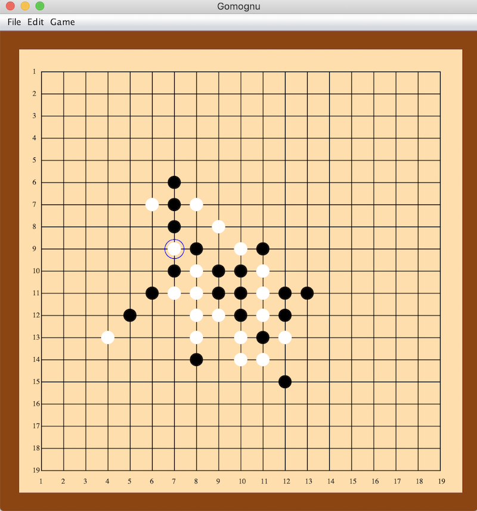

# Gomognu
Java Swing  <a href="https://en.wikipedia.org/wiki/Gomoku"> Connect five/Gomoku</a> game with a very intuitive GUI and a decent engine. 

<h1><b>Features </b></h1>

<ul>
  <li>Only the 19x19 board game is currently available</li>
  <li>Two player mode</li>
  <li>Play against AI(only one level)</li>
  <li>Saving and loading games</li>
  <li>Switch side while game is in session</li>
  <li>Undo/Redo</li>
</ul>

<h1> AI Implementation</h1>

